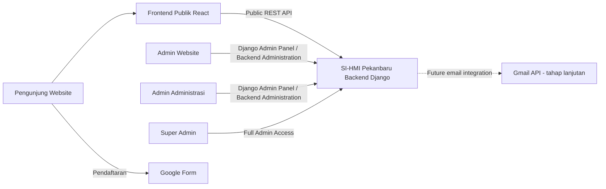
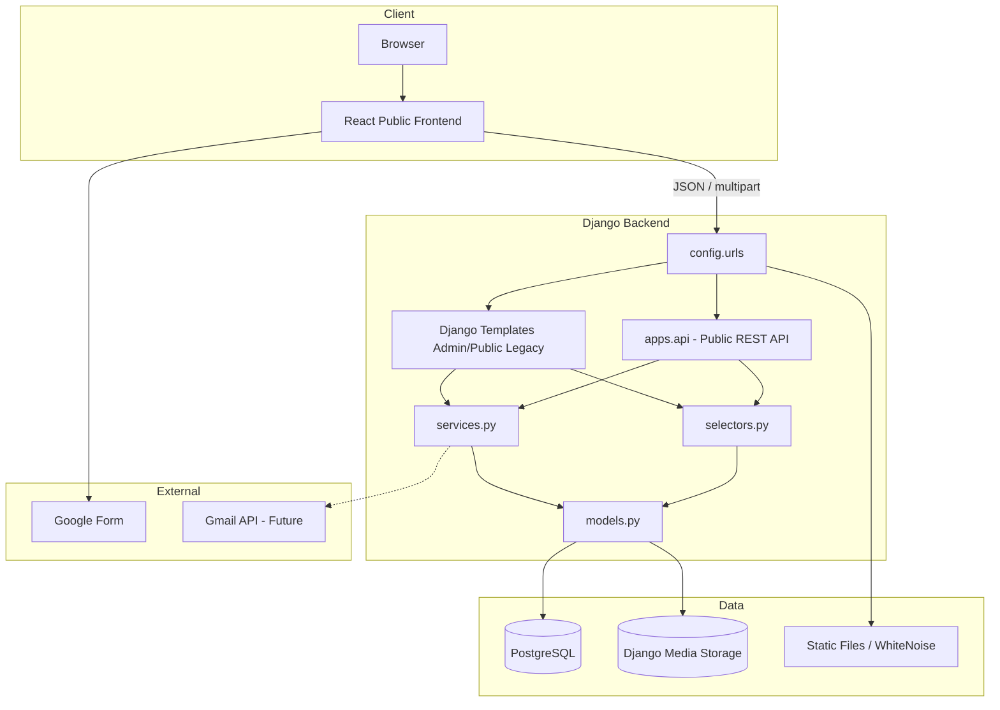
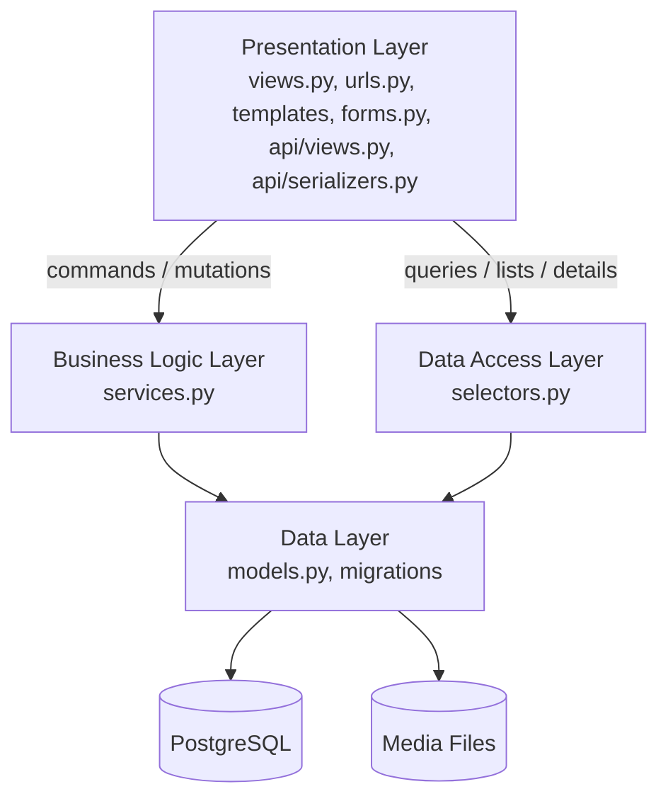
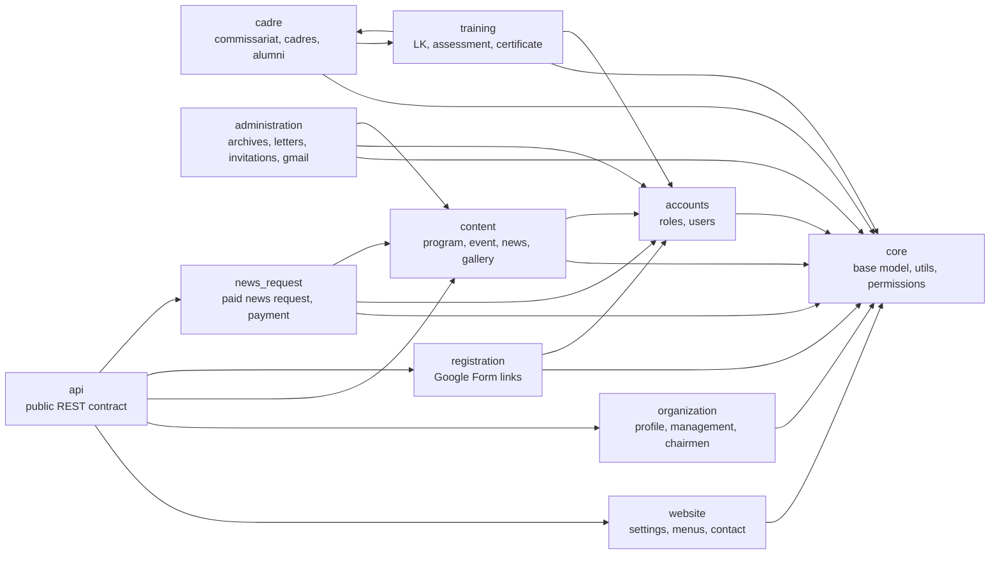
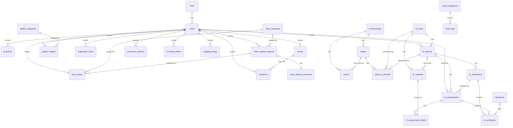
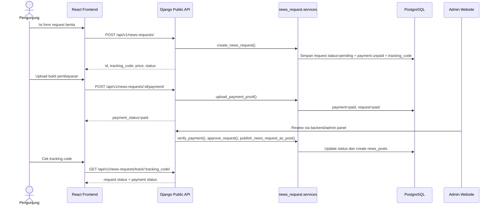
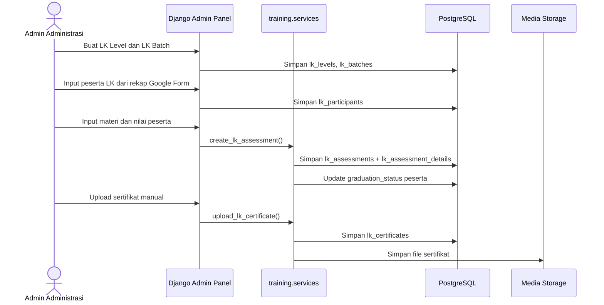
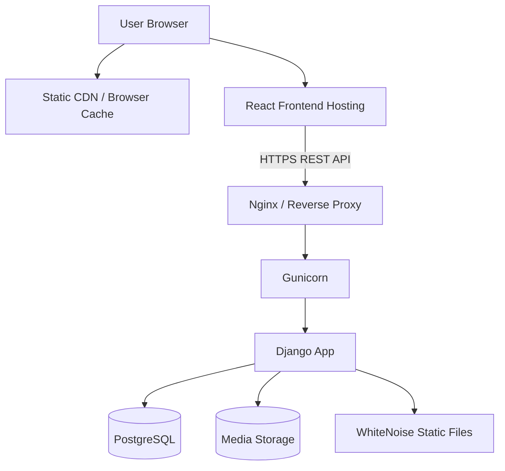

# Backend Diagrams - SI-HMI Pekanbaru

Dokumen ini berisi diagram utama yang diperlukan untuk dokumentasi backend Django SI-HMI Pekanbaru. Format diagram memakai Mermaid agar bisa dirender di GitHub, GitLab, Obsidian, Notion tertentu, atau Mermaid Live Editor.

## Diagram Yang Diperlukan

1. **System Context Diagram**: menunjukkan aktor eksternal dan batas sistem.
2. **Container Diagram**: menunjukkan frontend, backend Django, database, media storage, dan layanan eksternal.
3. **Django Layered Architecture Diagram**: menunjukkan pola 4 layer dari PRD.
4. **Application Module Diagram**: menunjukkan pembagian app Django per domain.
5. **Public API Contract Diagram**: menunjukkan endpoint API publik untuk React.
6. **ERD Domain Diagram**: menunjukkan relasi tabel utama.
7. **Request Upload Berita Flow**: menunjukkan flow request berita berbayar.
8. **LK Assessment & Certificate Flow**: menunjukkan flow penilaian LK dan upload sertifikat.
9. **Deployment Diagram**: menunjukkan topologi production.

---

## 1. System Context Diagram



---

## 2. Container Diagram



---

## 3. Django Layered Architecture Diagram



Rules:

- Views/API tidak berisi query kompleks.
- Services menangani create/update/delete dan validasi bisnis.
- Selectors menangani query, filter, `select_related`, `prefetch_related`.
- Models hanya representasi schema, choices, constraints, indexes.

---

## 4. Application Module Diagram



---

## 5. Public API Contract Diagram

```mermaid
flowchart TB
    react[React Public Frontend]

    subgraph API["/api/v1"]
        home[GET /home/]
        profile[GET /organization/profile/]
        management[GET /organization/management/]
        chairmen[GET /organization/chairmen/]
        programs[GET /programs/<br/>GET /programs/:slug/]
        events[GET /events/<br/>GET /events/:slug/]
        news[GET /news/<br/>GET /news/:slug/<br/>GET /news/categories/]
        gallery[GET /gallery/<br/>GET /gallery/categories/]
        forms[GET /registration-forms/]
        contact[POST /contact-messages/]
        requestNews[POST /news-requests/]
        payment[POST /news-requests/:id/payment/]
        tracking[GET /news-requests/track/:tracking_code/]
    end

    react --> home
    react --> profile
    react --> management
    react --> chairmen
    react --> programs
    react --> events
    react --> news
    react --> gallery
    react --> forms
    react --> contact
    react --> requestNews
    react --> payment
    react --> tracking
```



OpenAPI:

```text
GET /api/schema/
GET /api/docs/
```

---

## 6. ERD Domain Diagram



---

## 7. Request Upload Berita Flow



---

## 8. LK Assessment & Certificate Flow



---

## 9. Deployment Diagram



Production notes:

- `DEBUG=False`
- `SECRET_KEY` dari environment
- `ALLOWED_HOSTS` domain production
- `CORS_ALLOWED_ORIGINS` domain frontend React
- Static via WhiteNoise atau CDN
- Media via local mounted volume atau object storage
- PostgreSQL wajib backup rutin

